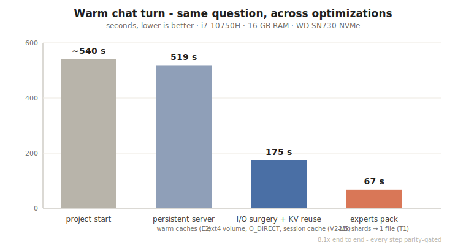
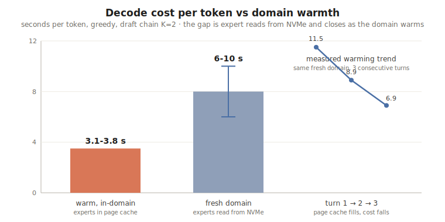
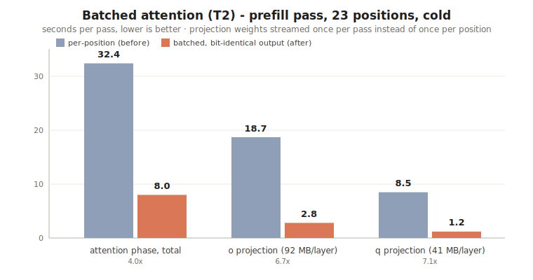
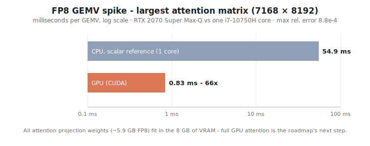

# Wohper

**A 284-billion-parameter model, alive on a laptop with 16 GB of RAM.**

Wohper is a small native inference engine written in Rust, optimized for
exactly one model: [DeepSeek-V4-Flash](https://huggingface.co/deepseek-ai)
(284B total parameters, 13B active, Mixture-of-Experts). It is intentionally
narrow: not a general-purpose runner, not a wrapper around another runtime -
it is self-contained, and every design decision assumes this one model and
one hostile constraint: the weights (163 GB on disk) will never fit in RAM.

The project's goal is to make this one model feel *finished* end to end on a
commodity machine: correct math (bit-parity-gated against DeepSeek's official
reference implementation), a persistent server, an OpenAI-compatible API, a
terminal chat, session KV caching, speculative decoding, and honest speed
numbers for all of it.

Project by [Ilben](https://github.com/twenytwo) (contact via GitHub
profile). Cards on the table: I am not an engineer in this field. I am a
19-year-old who wanted to see whether a model this size could run on the
machine he already owns - so expect rough edges, and read every claim with
that in mind. The project exists precisely to involve the community in
making scenarios like this more and more feasible: every optimization below
started as a profiler line, was implemented, exactness-gated, measured, and
logged - including the ones that failed - and there is plenty left on the
table for anyone who wants to push further. Issues and pull requests are
welcome.

- Terminal chat: `py -X utf8 tools/wohper_cli.py`
- OpenAI-compatible API: `http://127.0.0.1:8114/v1/chat/completions`

A note on names: the engine's internal prefixes (`zc_*` binaries, `ZC_*`
environment variables, `zc-*` Docker volumes) predate the project's current
name and are kept for stability.

## Motivations

Every mainstream tool for local inference starts from the same axiom: the
model must fit in RAM (or VRAM), quantized until it does. On a 16 GB machine
that axiom caps you at roughly a 13B dense model, usually at reduced
precision.

We took the opposite bet:

- **A MoE model is mostly asleep.** DeepSeek-V4-Flash activates ~13B of its
  284B parameters per token - 6 routed experts out of 256 per layer, chosen
  by a router at run time. Per token that is ~3.4 GB of expert weights out of
  163 GB. You do not need the model in RAM; you need *this token's experts*,
  fast.
- **An NVMe SSD can serve that.** Modern consumer SSDs read at GB/s. If the
  runtime reads *only* what the router asks for, with `O_DIRECT` and real
  parallelism, the SSD becomes the memory and RAM becomes a cache. The amount
  of RAM stops being a hard cutoff ("can I run this model?") and becomes a
  speed dial.
- **No quality compromises.** No requantization, no approximations: the model
  runs in its native formats (FP4 experts, FP8 dense) and the kernels are
  compared bit-for-bit against DeepSeek's official `inference/model.py`. We
  measured what happens if you push further - 2-bit requantization of the
  FP4-QAT experts destroys quality (2/5 argmax match in simulation) - and
  kept the receipts.

One machine, one model, exactness first. Everything else follows from that.

## The machine (and how it limited us)

Every number in this README was measured on one laptop:

| Component | Spec | How it limited us |
|---|---|---|
| CPU | Intel i7-10750H, 6 cores / 12 threads | AVX2 only (no AVX-512): FP8 dequant runs on a gather-LUT kernel, ~7 GMAC/s aggregate - the current decode compute ceiling |
| RAM | 16 GB physical (13 GB visible to the WSL2 VM) | dense weights + KV + caches leave only ~3 GB of page cache for a 161.6 GB expert pack; every byte is contested, and an expert RAM cache actively *hurts* at this size (measured: it thrashes and evicts the page cache) |
| SSD | WD SN730 1 TB NVMe | ~1.5-2 GB/s effective; fresh-domain questions are I/O-bound at 6-10 s/token until the domain warms |
| GPU | RTX 2070 Super Max-Q, 8 GB | discovered late in the project; all attention projection weights (~5.9 GB FP8) fit in VRAM - spike done (66x on the hottest GEMV), full integration is the next milestone |
| OS | Windows 11 + WSL2 + Docker | a Docker bind mount silently taxed every model read 10-35x until the weights moved to a native ext4 volume; WSL2's io_uring accepts fixed-buffer submissions and then never delivers completions (we detect it and fall back to preads) |

The honest summary: this machine runs the model *correctly*, at
chat-usable speed for warm, direct questions. It cannot make cold domains
fast (NVMe-bound) or huge prompts instant (CPU-bound). Those need more RAM,
more cores, or the GPU path - see "Scaling up".

## Status

Beta-quality engine, working end to end. Every claim is backed by a logged,
dated run.

| Milestone | Result |
|---|---|
| Full DeepSeek-V4-Flash (284B / 13B active, native FP4 experts + FP8 dense) | runs in 16 GB RAM, peak ~9.8 GiB, ~174 GB on disk (12.5 GB dense core + 161.6 GB experts pack) |
| Output quality | argmax parity with the official reference on every gate; 15/16 on the factual suite; multi-turn chat validated |
| Warm chat turn | ~9 minutes at project start → **~67 s** (same-domain, short answer) |
| Direct answers (no-think mode) | simple questions in **8-23 generated tokens** (~30-90 s warm) |
| Steady decode | ~3.1-3.8 s/token in-domain; 6-10 s/token on fresh domains, improving as the domain warms |
| Prefill | ~2.5 s/position cold; attention share of prefill cut 4x by batching (bit-identical) |
| Long context | needle retrieval correct at 532 positions - 4x past the 128-token sliding window, through the DSA compressor |
| Multi-turn history | free - session KV cache; only new tokens are prefilled; 2-4 concurrent conversations keep separate slots |
| Speculative decoding | model's own MTP head, chain K=2, exact greedy verification, 70-100% accept in-domain |

Known limits, stated plainly: sampling is fully validated for pure greedy
(temperature 0); a client that disconnects mid-generation does not yet cancel
the engine's work; and we have an open investigation on occasional truncated
words in *Italian* outputs ("Come pos aiutarti") - reproduced identically on
every serving path (stream/non-stream, speculative/sequential,
thinking/no-thinking), which localizes it to the model's argmax on
low-context Italian rather than to the serving stack; an official-reference
parity run on those exact prompts is the next validation step. English
output is clean on our whole suite.

## Speed

Measured on the machine above, greedy decoding, `ZC_PROF=1` breakdowns
logged for every pass.



The 8.1x on a warm turn came from eight profiler-driven steps, each
parity-gated (see "How we reasoned"). The remaining cost splits by phase:



Prompt prefill is dominated by attention no more: the batched phase-1 path
(T2) streams each projection matrix once per pass instead of once per
position, with bit-identical output:



And the next milestone is already de-risked - the hottest GEMV of the
attention path, on the GPU that was sitting in this laptop all along:



Reference points in numbers:

| Scenario | Measured |
|---|---|
| Warm turn, same domain, short answer | ~67 s |
| First turn after a server restart | 2-4 min (caches warming) - leave the server running |
| Decode, in-domain | 3.1-3.8 s/token (K=2 chain, 3 tokens per verify pass) |
| Decode, fresh domain | 6-10 s/token, trending down (measured 11.5 → 8.9 → 6.9 s/token over 3 turns in one new domain) |
| Prefill, cold, 23 positions | 57.9 s/pass (was 80.8 before batched attention) |
| Long-context prefill | ~2.5-2.9 s/position, linear from 300 to 532 positions measured |
| GPU spike, 7168×8192 FP8 GEMV | 0.83 ms vs 54.9 ms scalar CPU, max rel. error 8.8e-4 |

## Running a model larger than RAM

This is the core of the project, so it deserves its own section.

The converted model is two artifacts on a native ext4 Docker volume:

- **Dense core** (12.5 GB, FP8): attention projections, norms, routers,
  embeddings, lm_head, MTP head - everything that runs for *every* token.
  Cached in RAM (`ZC_DENSE_CACHE_MB`, 6100 on this machine: exactly the 43
  transformer layers).
- **Experts pack** (161.6 GB): all 11,008 routed experts consolidated into
  one 2 MB-aligned file, read with parallel `O_DIRECT` `pread`s on a single
  file descriptor. No per-expert open/close, no page-cache churn from
  metadata. Consolidating the pack alone took a warm turn from 175 s to 67 s.
  The pack builder is resumable and verifies before deleting the source
  shards.

Per token, the router selects 6 experts per layer; the engine reads only
those (~3.4 GB/token across 41 routed layers, much less once the OS page
cache holds the working set of a warm domain). During prompt prefill,
positions are processed layer-major with the *union* of their experts, so
each expert is read once per layer instead of once per position.

What we measured and rejected on this RAM budget - kept in the tree, off by
default: an in-process expert RAM cache (thrashes below ~24 GB and evicts
the page cache that expert reads rely on - net negative), speculative
expert prefetch (neutral on a saturated NVMe: spurious reads steal exactly
the bandwidth they hoped to hide), 2-bit requantization (destroys FP4-QAT
quality). On bigger machines the first two flip to wins - the knobs exist.

## How it works

The runtime is a single Rust binary (`zc_infer_server`) that owns the model
and serves requests on a Unix socket, one at a time. Around it: a Python
shim that speaks the OpenAI protocol (port 8114) and the terminal chat. Inside the binary:

**I/O layer.** `O_DIRECT` everywhere the data is big: dense blocks through
an io_uring path with registered 2 MB-aligned fixed buffers (with automatic
fallback to plain preads where io_uring is broken - looking at you, WSL2),
experts through parallel scoped-thread preads on the pack. Nothing large
ever goes through the page cache twice.

**Compute kernels.** Fused FP4/FP8 LUT-decode + AVX2 FMA micro-kernels,
row-parallel across cores. The FP8 path decodes through a 256-entry LUT with
per-128-column-group UE8M0 scales; the batched variant decodes each weight
row once and reuses it for every position in the pass with the same
group-wise reduction order - which is why its output is bit-identical, not
just close.

**DeepSeek-specific fidelity.** This model is not a vanilla transformer:
mHC hyper-connections (Sinkhorn-normalized combination matrices), MLA
attention with grouped low-rank output projection, QAT FP8 activation
quantization before *every* FP8 matvec, per-layer YaRN rope, and the DSA
short-context compressor that lets attention see 4x past its 128-token
sliding window. Each of these was implemented against the official
`inference/model.py` and compared at the bit level. Three of the nastiest
bugs in the project were found by bisecting layer outputs against the
reference: a missing activation quant (4e-3 error hiding as "close
enough"), a transposed combination matrix (invisible at short context), and
an off-by-one in the decode loop (sampling from the wrong position).

**Speculative decoding (MTP).** DeepSeek-V4 ships its own
multi-token-prediction head; we run it as a draft head with chains of K=2
and verify with a batched pass that keeps pure-greedy output exact -
rejected drafts roll back through a position-indexed undo stack in the
compressor state. Measured accept 70-100% in-domain. K=4 was tried and
rejected with numbers (accept 1-2/4, ~10 s/token - the recursive draft
degrades past depth 2).

**Batched attention (T2).** The profiler showed the o/q projection
*weights*, not the softmax, dominating attention: ~133 MB re-streamed per
position per layer (~5.5 GB per position across the model). The batched
phase-1 path streams each matrix once per pass; the first position pays the
LUT gather and stores the decoded row, the rest ride plain FMA dots on it.
Prefill attention: 4x. Kill-switch: `ZC_MLA_BATCH=0`.

**Session KV cache, multi-slot.** The KV cache *and the compressor state*
of each finished conversation are snapshotted into one of 2-4 LRU slots
(~180 MB each at `ZC_KV_SLOTS=1024`). A follow-up turn restores its own
conversation's state verbatim and prefills only the new tokens. Two
alternating users keep separate slots instead of destroying each other's
prefix - validated with an interleaved two-conversation gate where both
turn-2 answers required their own turn-1 context.

**Thinking is optional.** DeepSeek-V4 reasons before answering. At seconds
per token, that preamble was the single biggest source of perceived
slowness: a simple math question spent 69+ tokens thinking before we cut it
off. `"reasoning": false` pre-fills the `</think>` special token so the
model answers directly - same question, 23 tokens. If the model re-emits
`</think>` anyway, the shim treats it as a stop. The terminal chat exposes this as a
toggle (/think), off by default.

**Observability.** `ZC_PROF=1` prints a per-phase wall-clock breakdown of
every pass (dense load, attention q/kv/compressor/window/o, routing, expert
I/O, expert compute, finish). Every optimization in this README started as a
line in that output.

## How we reasoned

The method mattered more than any single trick:

1. **Exactness first, speed second.** Nothing ships unless output is
   bit-identical (or argmax-identical where f32 reassociation is inherent)
   to the reference. Every speed change re-runs the gates. This is why eight
   stacked optimizations never made the model subtly dumber.
2. **Profile, don't guess.** The attention softmax "obviously" looked like
   the hotspot. The profiler said 1 s out of 32 - the weight streaming was
   27 s. We built for what the numbers said.
3. **Failed experiments are results.** K=4 chains, 2-bit quant, expert RAM
   cache at 13 GB, speculative prefetch on saturated NVMe: all measured, all
   rejected with numbers, all logged. Knowing *why* they fail on this
   hardware keeps the roadmap honest - and tells you exactly when they start
   working (more RAM, more of everything).
4. **The bottleneck moves.** Disk layout → I/O syscalls → prefill →
   speculative decode → session reuse → attention compute → (next) GPU.
   Each fix exposes the next wall; the profile tells you where it went.
5. **The field test is the test.** Several of the worst bugs (EOS handling
   that kept generating past the answer, the single-slot cache ping-pong,
   the thinking-latency diagnosis) were found by a human using the chat
   normally while the numbers looked fine.

## On-disk model format

Wohper only runs models converted by its own tools. The format is deliberately
simple and inspectable:

- **Dense core** (`dense_core.bin`): a sequence of `ZCBLK01` blocks, one per
  layer plus global blocks (embeddings, lm_head, MTP). Each block is a
  self-describing container of named tensors with their quant format (FP8
  E4M3 + UE8M0 group scales for dense weights, packed FP4 E2M1 for experts,
  BF16 for norms/aux), shapes, and 2 MB-aligned payloads.
- **Shard map** (`dense_core.shards.json`, format `wohper-sharded-experts`):
  maps every routed expert to its blob. Models converted before the project
  rename carry the legacy magic and remain loadable.
- **Experts pack** (`dense_core.experts_pack.bin` + `.experts_pack.json`,
  format `wohper-experts-pack`): the consolidated single-file layout, offsets
  2 MB-aligned for `O_DIRECT`.
- **Row index** (format `wohper-row-tensor-index`): row-addressed offsets
  into the core for tensors that are read by row at run time (embedding
  lookups, lm_head rows, the MTP head), so sampling never loads whole
  matrices.

The converter (`tools/stream_convert_deepseek_v4.py`) streams the official
safetensors shard-by-shard and never needs the model in RAM.

## More documentation

- [docs/architecture.md](docs/architecture.md) - engine architecture.
- [docs/demo_16gb.md](docs/demo_16gb.md) - the reproducible 16 GB demo procedure.
- [docs/gpu-offload-plan.md](docs/gpu-offload-plan.md) - the GPU attention plan, with the spike numbers.
- [docs/compute-kernel-plan.md](docs/compute-kernel-plan.md) - kernel design notes.
- [docs/reference-parity-contract.md](docs/reference-parity-contract.md) - what "bit-parity-gated" means exactly.
- [docs/test-matrix.md](docs/test-matrix.md) - the regression matrix.
- [docs/model-quality-prompt-set.md](docs/model-quality-prompt-set.md) - the factual quality suite.
- [docs/transformer_math_fidelity_audit_2026-07-03.md](docs/transformer_math_fidelity_audit_2026-07-03.md) - the math fidelity audit.
- [docs/deepseek_v4_flash_architecture_parity_2026-07-06.md](docs/deepseek_v4_flash_architecture_parity_2026-07-06.md) - architecture parity notes.
- [docs/linux-environment-setup.md](docs/linux-environment-setup.md), [docs/linux-benchmark-runbook.md](docs/linux-benchmark-runbook.md) - environment and benchmark runbooks.

## Bringing it to life from a fresh clone

You need: 16 GB+ RAM, ~380 GB free NVMe during conversion (~174 GB after;
the checkpoint ships natively quantized, so the download is far smaller
than a BF16 one would be),
Docker, Python 3.10+, and patience for a one-time download.

```bash
# 0. Clone
git clone https://github.com/twenytwo/wohper
cd wohper

# 1. See what your machine can do (RAM/CPU/disk/GPU/Docker report and the
#    tuning that will be applied automatically):
py -X utf8 tools/wohper_setup.py

# 2. Download the official DeepSeek-V4-Flash checkpoint from HuggingFace
#    (~160 GB of natively quantized safetensors - measured from the shard
#    index: 46 shards, FP4 experts + FP8 dense. One-time; resumable;
#    refuses to fill the disk):
py -X utf8 tools/wohper_setup.py --fetch-model
#    Low on disk? Download in batches, converting and deleting between them:
#    py -X utf8 tools/wohper_setup.py --fetch-model --fetch-limit 8

# 3. Convert to Wohper's on-disk format (streams shard-by-shard, no RAM
#    spike), then build the row-addressed tensor index:
python tools/stream_convert_deepseek_v4.py --model-dir models/deepseek-ai/DeepSeek-V4-Flash --out models/wohper/DeepSeek-V4-Flash.RAW --execute
python tools/build_deepseek_v4_tensor_index.py --model models/wohper/DeepSeek-V4-Flash.RAW

# 4. Move the converted model onto a native Linux filesystem (Docker volume).
#    Never serve it from a Windows bind mount - measured 10-35x slower.
docker volume create zc-model    # copy dense_core.bin + shards + indexes in

# 5. Consolidate the 11k expert shards into the single experts pack
#    (resumable, verifies before deleting sources)
python tools/build_experts_pack.py --model-dir /model-fast --resume

# 6. Build the engine image; the terminal chat boots everything on first run
docker build -f engine/zc_infer_core/Dockerfile.dev -t zc-infer-dev .
py -X utf8 tools/wohper_cli.py

# 7. Chat.
#    Terminal:  py -X utf8 tools/wohper_cli.py
#    API:       POST http://127.0.0.1:8114/v1/chat/completions
```

The first question after a cold start takes a few minutes while caches warm.
Leave the server running: every following turn pays only for its own new
tokens. The golden rule of this project: **the server stays on.**

## Terminal chat

```
py -X utf8 tools/wohper_cli.py
```

A boxed-composer TUI, streamed dim thinking, a live
elapsed counter during the silent prefill wait, and a footer with
thought/total seconds and token count. It boots the Docker container and the
API on first run.

| Key / command | Effect |
|---|---|
| Enter | send |
| `\` at end of line | continue on a new line |
| Ctrl+C | stop the current generation (twice at the prompt: exit) |
| `/new` | new chat |
| `/lang en\|it` | interface language (persisted) |
| `/think on\|off` | extended thinking (off = fast direct answers) |
| `/max N` | max answer tokens |
| `/system TEXT` | replace the system prompt |
| `/help`, `/quit` | help, exit |

## Server API

The shim (`tools/zc_openai_server.py`) exposes on port 8114:

- `GET /health` - liveness JSON
- `GET /v1/models`
- `POST /v1/chat/completions` - OpenAI-style, SSE streaming supported

`/v1/chat/completions` accepts `messages`, `max_tokens`, `temperature`,
`stream`, and one Wohper extension: `"reasoning": false` (alias
`"think": false`) for the no-think fast path. Thinking output is returned
DeepSeek-style as `reasoning_content`, the final answer as `content`. When
the client sends no system message, a default one is injected that makes the
model answer in the user's language. Greedy (`temperature: 0`) keeps the
speculative fast path; temperature > 0 falls back to the sequential sampler.

```bash
curl http://127.0.0.1:8114/v1/chat/completions -d '{
  "model": "wohper-deepseek-v4-flash",
  "messages": [{"role": "user", "content": "What is the capital of France?"}],
  "max_tokens": 64,
  "reasoning": false,
  "stream": true
}'
```

Beyond plain chat, the shim does **tool calling**: pass OpenAI `tools`
in the request and it renders them into DeepSeek's native DSML tool
format, then parses the model's tool calls back into OpenAI `tool_calls`
(`finish_reason: "tool_calls"`). Send the tool output back as a
`{"role": "tool", ...}` message and the multi-step agent loop closes. This
is what lets the local model *act* (call tools, run an agent), not just
answer - so agents like [OpenClaw](https://openclaw.ai) can use
DeepSeek-V4-Flash as a fully local brain. See
[docs/agent-integration.md](docs/agent-integration.md) for the setup and
an honest note on speed (great for async/background work, not snappy
real-time loops).

Any OpenAI-compatible agent client can point at it. Example for opencode
(`~/.config/opencode/opencode.json`):

```json
{
  "provider": {
    "wohper": {
      "npm": "@ai-sdk/openai-compatible",
      "options": { "baseURL": "http://127.0.0.1:8114/v1", "apiKey": "local" },
      "models": { "wohper-deepseek-v4-flash": { "name": "Wohper (local)" } }
    }
  }
}
```

Realistic expectation setting for agents: the engine serves one request at a
time, and multi-turn agents benefit heavily from the session KV cache
(history is never re-prefilled). Batch/overnight agent workloads are the
sweet spot on this hardware today; interactive agents want the GPU milestone.

## Scaling up: does this run better on a stronger machine?

Yes - mostly linearly, because every bottleneck we hit is a hardware quantity
you can buy more of. The runtime already exploits each axis, and since the
defaults were measured on the 16 GB machine, the launcher re-tunes them for
yours: at every start `wohper_cli` reads the physical RAM and sizes the
dense cache, the expert RAM cache (off below ~24 GB where it measurably
thrashes, on above), the KV slots and the conversation slots for that tier.
`py -X utf8 tools/wohper_setup.py` shows the full report; any `ZC_*`
variable you set yourself always wins.

| Upgrade | What it removes | Expected effect (measured basis) |
|---|---|---|
| RAM 16 → 32 GB | page-cache starvation for the 161.6 GB pack | fresh-domain decode 6-10 s/token → approaches the warm 3.5; the expert RAM cache flips from harmful to useful |
| RAM 64 GB+ | most expert I/O for a working set | in-domain decode approaches the CPU compute floor (~2 s/token on this CPU) |
| Faster NVMe (PCIe 4/5) | the ~1.5-2 GB/s read ceiling | cold-domain tokens scale with read speed; a 7 GB/s drive ≈ 3-4x on the I/O share |
| More cores / AVX-512 | the AVX2 gather ceiling (~7 GMAC/s) | attention + expert compute scale near-linearly with cores |
| Any 8 GB+ GPU | attention projection compute | spike measured: 70.5 GMAC/s vs ~7 on CPU; all attention weights fit in 8 GB VRAM |
| Native Linux | WSL2 taxes (broken io_uring, VM RAM cap) | free 10-20% |

For context, the same laptop running conventional RAM-fit stacks:

| Setup on this laptop | Params (active) | Fits where | Speed | Quality class |
|---|---|---|---|---|
| 7-8B Q4 (llama.cpp-class) | 8B | RAM | ~8-15 tok/s | small-model |
| 13B Q4 (llama.cpp-class) | 13B | RAM, tight | ~4-8 tok/s | small-model |
| 70B Q4 | 70B | does not fit | - | - |
| **Wohper, DeepSeek-V4-Flash** | **284B (13B)** | **NVMe + 16 GB RAM** | **~0.3 tok/s warm** | **frontier-class MoE, native precision** |

(Small-model rows are reference figures for this CPU class, not our
measurements. Nothing else known to us runs a 284B model on this machine at
all.) The trade in one line: two orders of magnitude more model than the
machine "should" run, at a patient pace, with the math checked instead of
requantized.

## Benchmarking and profiling

Everything is reproducible with in-tree tools:

```bash
# Per-phase wall-clock profile of every pass (the tool behind every chart above)
docker run ... -e ZC_PROF=1 ... zc-infer-dev bash scripts/deepseek_chat_server.sh

# Multi-conversation session-cache gate (two interleaved chats, checks slot reuse)
py -X utf8 tools/test_multislot_pingpong.py

# Factual quality suite (15/16 on this machine)
python tools/quality_suite.py

# GPU spike (needs --gpus all and the nvidia-cuda-nvrtc-cu12 pip wheel)
cargo build --release --features gpu --bin gpu_gemv_spike && ./gpu_gemv_spike
```

`prof_pass` lines give the phase split (dense, attention, routing, expert
I/O, expert compute, finish); `prof_phase1_detail` splits attention into
q / kv / compressor / window / o. When you change anything, run the parity
gates first, the profiler second.

## Debugging notes

When a generation looks wrong, in order:

- `ZC_DUMP_ATTN=<dir>` dumps raw f32 buffers at layer 0 / position 3 for
  bit-level comparison against the numpy reference formulas (this found the
  activation-quant and transposed-comb bugs).
- `ZC_MHC_DEBUG=1` prints per-layer L2 norms and sample values at each
  sub-block boundary - the fast way to see *which layer* diverges.
- `tools/zc_socket_smoke_client.py` talks to the engine socket directly with
  explicit token ids, cutting the tokenizer/template out of the equation.
- `tools/deepseek_v4_*_smoke.py` are narrow parity tests (single token,
  single layer, router, embeddings, row index...) that run without the full
  model.
- The batched attention path falls back to the sequential one automatically
  under any debug env, so debug flows always compare per-position.
- 83 Rust unit tests: `cargo test --release` in the dev container.

Two traps that cost us real days, so you do not pay them again: Git Bash
converts `/tmp/...` arguments into Windows paths unless
`MSYS_NO_PATHCONV=1` is set (a silently dead socket path), and `wsl
--shutdown` while Docker Desktop is running corrupts its backend sockets
(rename `AppData/Local/Docker/run`, never factory-reset - that deletes the
volumes, including the model).

## Roadmap

- **GPU attention** - spike done (66x on the hottest GEMV, <1e-3 rel. error,
  weights fit in VRAM); wiring into the server is next, expected ~2x decode.
- Cancel generation when the client disconnects (today the engine finishes
  the answer for nobody).
- A persistent thread pool for the attention kernels (spawn-per-call leaves
  CPU on the table: 400-690% of 1200% during decode).
- Official-reference parity run on Italian prompts (the truncated-words
  investigation).
- Re-measure long-context prefill after the batched-attention 4x; then
  1000+ position contexts stop being theoretical.

## Acknowledgements

This project would not exist without DeepSeek's open weights and, just as
importantly, their official reference implementation - having
`inference/model.py` to bisect against is what made "exactness first"
possible at all. The README structure and the project philosophy of "one
model, made to feel finished" owe an evident debt to Salvatore Sanfilippo's
[dwarfstar (ds4)](https://github.com/antirez/ds4) - a project we discovered
mid-way and that convinced us the narrow bet was the right one.

## License

MIT - see [LICENSE](LICENSE).
