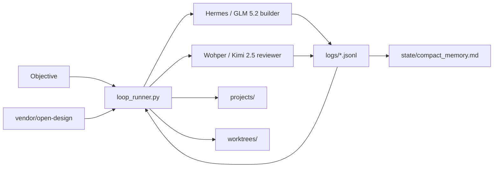

# Architecture

## Components

- `scripts/loop_runner.py`: alternates Hermes and Wohper, writes prompt files, ledger JSONL, and compact memory.
- `config/loop.config.json`: local-only runtime config with CLI commands and budgets.
- `skills/`: reusable instructions loaded into every turn.
- `vendor/open-design`: required Open Design integration for design systems, skills, plugins, and MCP/CLI adapter workflows.
- `.local/bin/kimchi`: isolated Kimchi binary installed by `scripts/install_kimchi_isolated.sh`.

## Flow

## Isolation

The bootstrap scripts write only inside this workspace:

- `.local/`
- `vendor/open-design`
- `state/`
- `logs/`
- `projects/`
- `worktrees/`

They do not edit shell rc files, global PATH, `/usr/local`, `/opt`, Navi, or database services.

## Open Design Integration

Open Design is used as:

- design and prototype skill source;
- design-system catalog;
- external agent adapter reference;
- future MCP bridge via `od mcp install hermes`, `od mcp install openclaw`, and `od mcp install kimi`.

The first integration step is a local clone. The second step is installing/using the `od` CLI after its own docs are verified in the cloned repo.
